The benefits of yoga are manifold. They range from helping to regulate anxiety, to allow for a better sleep and even helping with depression. However, there is always the question: Which of these benefits are really backed up by research? These days, more and more research is going in the area of yoga and health benefits. Today I want to talk with you about the benefits of yoga, the ones that are backed up by research as well as the subjective benefits.

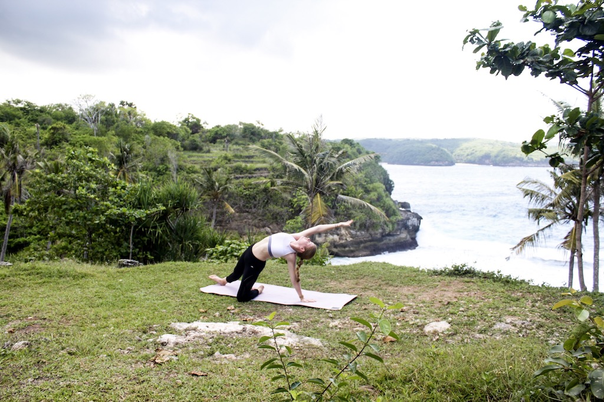

# Why is yoga so popular?

During the last years, there has been a huge hype around yoga. Suddenly everybody wanted to do it. I think that Instagram has played a huge role in yoga’s popularity. All these profiles of yogis getting into the weirdest positions surely makes a lot of people wanting to start with yoga in order to eventually be able to be as good as them.

However, another reason, I think, why yoga is so popular is because people are actually feeling that it is good for them. They feel that if they get on the mat, their minds feel calmer, the stress becomes less pressing, and the body feels better. I feel like right now everybody is really concerned for their health with all the superfoods, detox, and meditation being promoted. Maybe it’s just my impression but yoga fits in really well right now.

Also, it feels like the world has never been more fast paced than right now. Thus, it is important to relax and calm the mind from time to time. What could be better than a nice and peaceful yoga class?

What do you think? Has yoga always been that popular or why is there such a hype right now?

# The scientifically backed-up benefits of yoga

Since going to Thailand, I have tried to do yoga on a daily basis. I used to do daily yoga with mini workouts of a couple of minutes each day but here I really wanted to go to class every day to practice yoga for at least an hour. It is amazing how good that feels! Starting with a class in the morning, I have enough energy to get through the day easily. But this is just my subjective benefit of yoga. However, there are also scientifically backed-up benefits to yoga.

Meditation and other stress-reduction techniques have been studied for possible treatments for depression and anxiety since the 1970s. Yoga, however, has received less attention in medical literature, although it has become so popular. Unfortunately, many of the studies evaluating the benefits of yoga have been small and poorly designed. However, there could still be results drawn from some.

A German study published in 2005 for example found that yoga had an effect on the mood and functioning, improving the state of 24 women who had experienced emotional distress.

Another uncontrolled study examined the effect of one single yoga class for patients suffering from depression, schizophrenia, and bipolar disorder. The average level of anger, hostility, tension, anxiety, and fatigue dropped significantly.

Also the benefits of controlled breathing have been examined in studies. These revealed that a type of controlled breathing with roots in traditional yoga are very promising to help with [depression](https://www.health.harvard.edu/mind-and-mood/yoga-for-anxiety-and-depression).

Yoga can also assist with chronic insomnia, as a 2004 study suggests. This study showed that yoga improved sleep efficacy, total sleep time, total awake time, sleep onset latency, and wake time after sleep [onset](https://www.ncbi.nlm.nih.gov/pubmed/15707256).

# The most famous yoga poses and their benefits

Are you still looking for reasons to start yoga? Maybe these benefits will convince you to roll out your mat.

**1. Downward-facing Dog:**

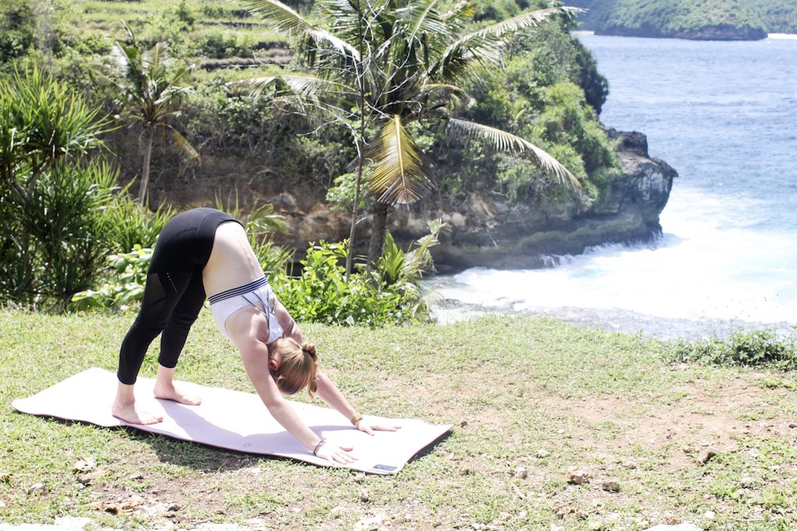

The downward-facing dog flushes your brain with fresh oxygen as your heart is higher than your brain, it also lengthens and decompresses the spine and stretches the hamstrings.

**2. Child’s Pose:**

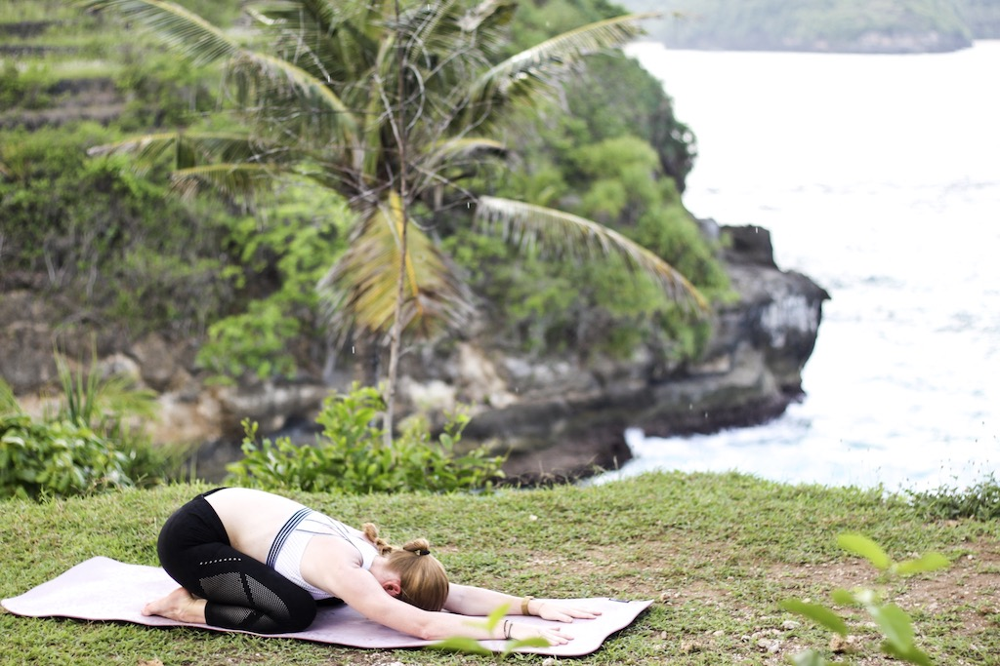

Child’s pose is a great pose if you need a rest. It calms your mind, improves digestion while also relieving back, neck and hip strain.

**3. Cobra Pose:**

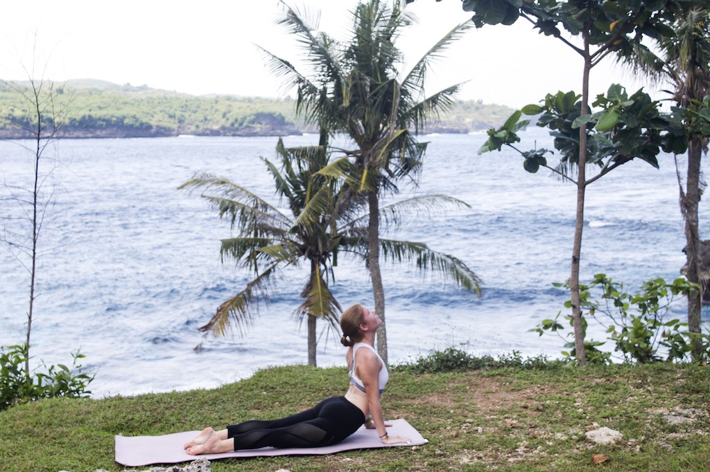

If you’re having trouble with your digestion, this pose might be your cure as it stimulates your abdominal organs. It also helps relieve fatigue and stress and opens the heart and lunges.

**4. Bow Pose:**

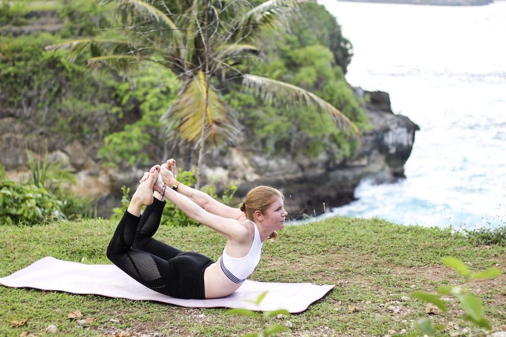

The bow pose is great if you’re experiencing fatigue. It also improves your posture and strengthens your back muscles.

**5. Chair Pose:**

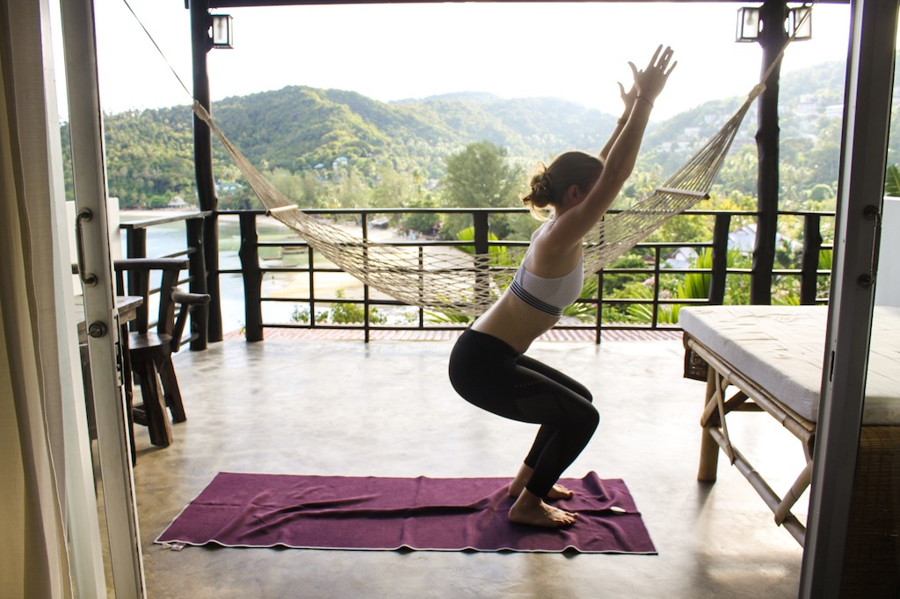

Having flat feet? Then you might want to try out the chair pose as it is said to reduce flat feet. Furthermore, it strengthens the ankles, calves, thighs, and the spine.

**6. Dolphin Pose:**

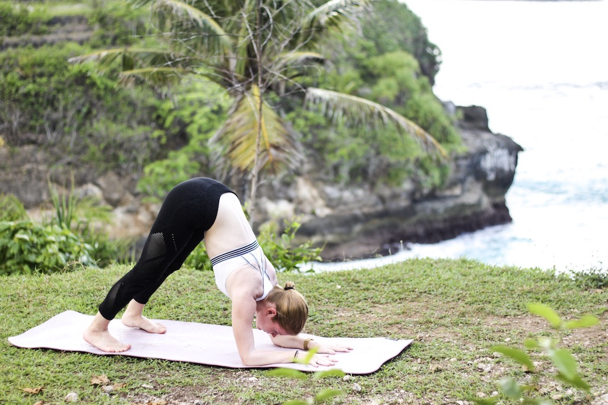

The dolphin pose is a pose with many benefits. It calms your mind and is said to help with depression and stress. Apart from strengthening arms and legs and stretching the shoulders, hamstrings, calves, and arches, it also relieves headaches and insomnia.

**7. Seated forward bend:**

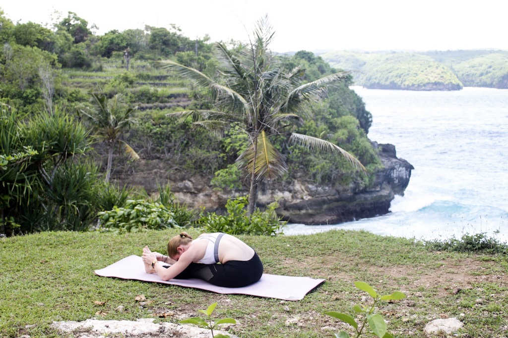

Hold for a little while, the seated forward bend helps calm your mind and relieve stress and depression. It stretches the spine and makes you more flexible in the area of the hamstrings. It is also said to help with headaches, infertility and high blood pressure.

**8. Standing forward bend:**

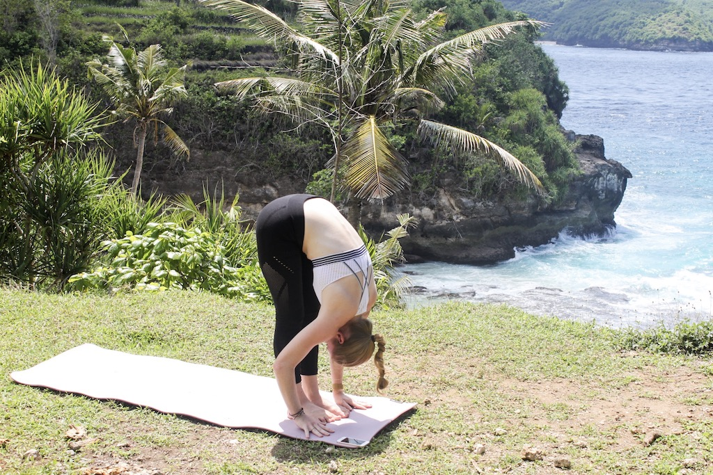

As your head is lower than your heart, this pose will help calm your mind and relieve stress and mild depression. It also reduces fatigue and anxiety and relieves headaches and insomnia. Apart from that, it really helps to stretch your hamstrings, calves, and hips.

**9. Warrior I:**

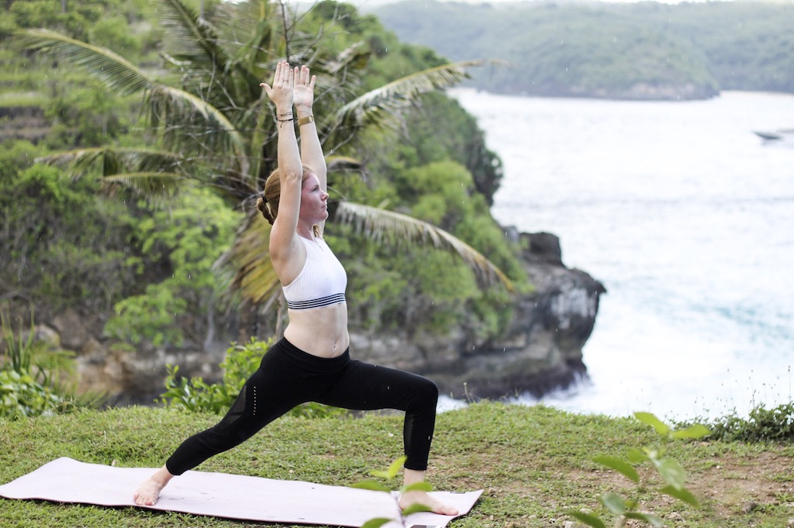

Warrior I is a great pose if you need to destress from a hectic day. Also, you strengthen your thighs and open your chest and shoulders which improves your posture.

**10. Warrior II:**

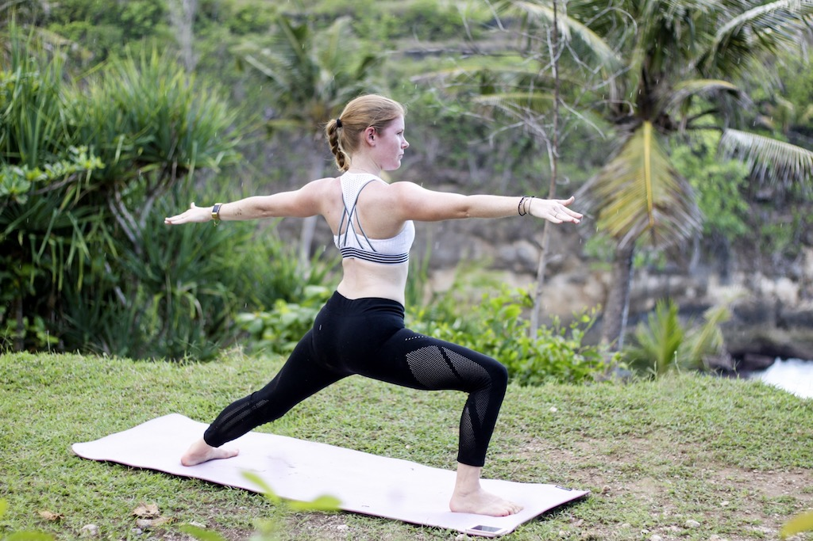

Warrior II helps you strengthening and stretching your legs and ankles while also stretching the groins, chest, shoulders and lungs. It also relieves backaches and stimulates your abdominal organs.

As you can see, yoga has a lot of benefits. So grab your mat, get started and do something for that body and mind of yours.
