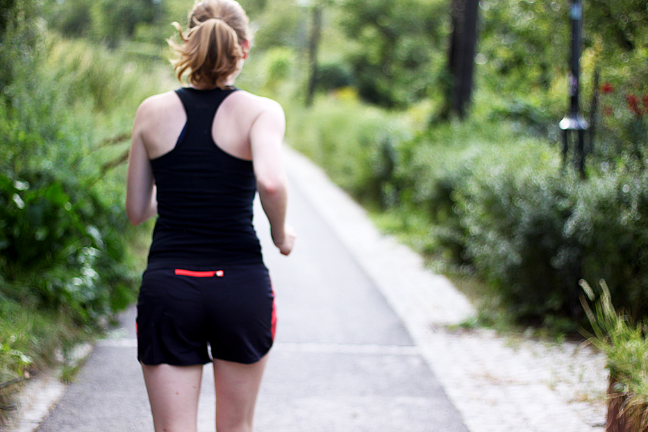
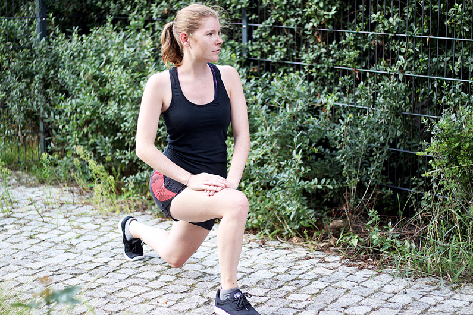
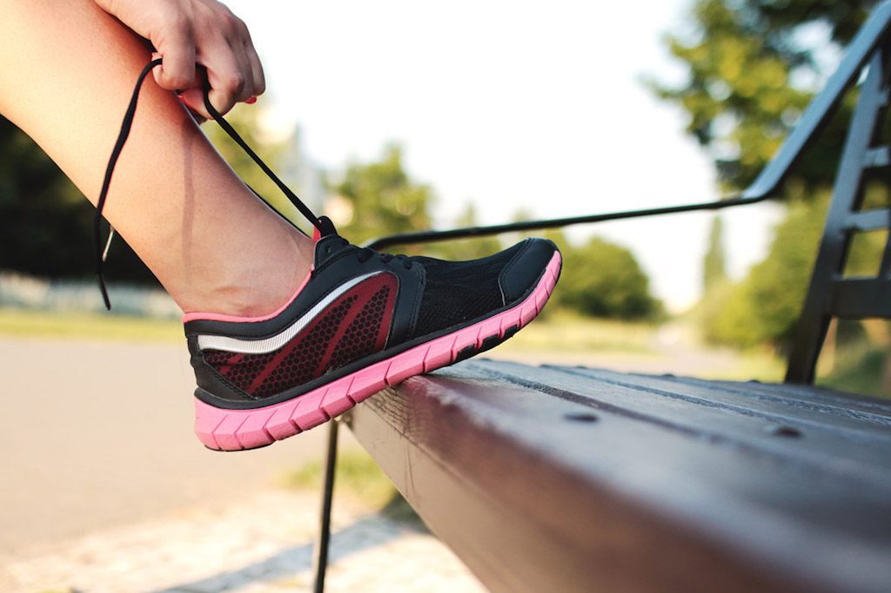
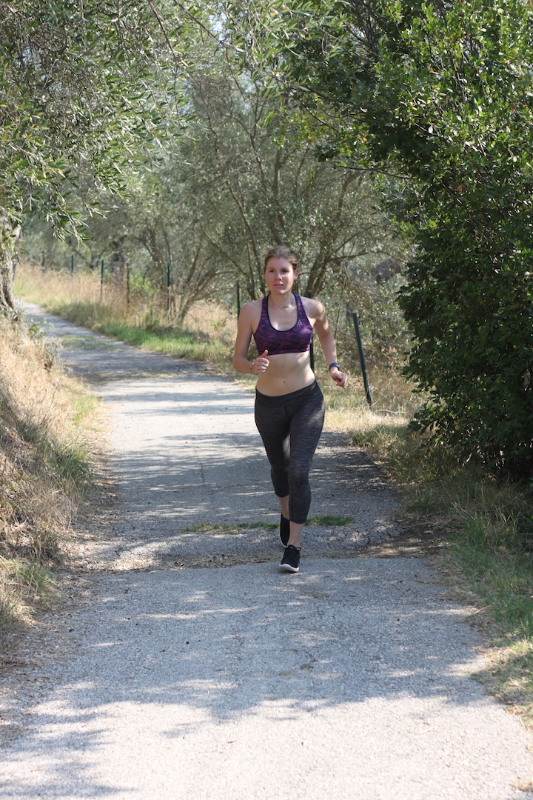

I’ve been running since I was 14 years old. I used to run with my dad, who, with almost 60 years, runs almost every day. He is not a marathon runner. He doesn’t sprint and he surely doesn’t win the methall for being the fastest. But he can run long. And I don’t mean 45 minutes long, though to many (myself included) this sounds already pretty impressive. He can run for hours. And he is the calmest, most stress-free person while running and in general.

Our father-daughter tradition of running together eventually faded away but I have kept on running ever since. Only nowadays I am running on a treadmill most of the time. It still calms me down whenever I am super stressed and of course it burns a hell of a lot of calories.

Now I am already pretty routined and I can see that getting started with running might look intimidating though it’s really not. So how do you actually get started with running?

# 6 Tips on how to get started with Running

1. **Start slow:** You don’t have to win a marathon or be the queen of sprints when you start running. How fast you can run depends on your own body schedule. Don’t be frustrated if you take a little longer for those first kilometers. Keep in mind that every run provides health benefits. You should rather concentrate on going further, not faster in the beginning. And of course you also don’t have to run every day, start with three times a week, that’s a pretty good start.


2. **Run slower:**  If you’re feeling out of breath or sick you can be sure that you have run to fast. In the beginning your training can even include quick walking. Try two minutes running and one minute walking to catch your breath. You’ll see, soon you’ll be able to stick to running only.


3. **The right equipment:** The good thing is, running doesn’t require much. What you should invest in though is a good pair of running shoes. Make sure they are explicitly for running, not tennis or anything else. Running puts a lot of stress on your joints. A good shoe reduces the shock that travels up your leg when striking the ground. And of course a stylish outfit helps motivate you to get into your running shoes and start running.


4. **Side stitches:** Side stitches are caused by a lack of oxygene in your GI muscles and are relatively common among beginners. If you’re facing side stitches try to exhale hard and long. Also bending over at the waist while exhaling can help. If you have to you can also slow down your running pace. Also be aware of what you eat before running. Solid food is really bad before your run.


5. **Out of breath:** Another relatively common phenomenon among beginners is to be out of breath. That’s because when running you breath harder than you usually do. What you should do is to concentrate on breathing deep down from your belly to get as much oxygene into your muscles as possible. That’s also why you should always breathe in and out through your mouth. And of course with practice it will get better soon. 


6. **Dynamic Stretches:** There are two types of stretching, the static ones, where you hold a stretch and the dynamic stretches, where you move through a range of motion. Before starting to run you want to warm up those muscles groups used for running. Warm up those muscles with flexion and extension of the legs, and lateral movements. Try out dynamic stretches like Walking Lunges (get in a lunge with the right foot in front, then get up and take the next step with the left leg in front), Hip Circles (feet hip width apart, hands on your hips, now rotate your hips clockwise and counterclockwise), or Butt Kicks (kick your heels into your butt while starting to run).

Now that we’ve set up the basics, the single most important ingredient is still missing: The motivation. Because all those tips aren’t of any value if we won’t make it into our running shoes, right?

# How to get your ass up running

Though we know we should, it’s often so hard to get into our gym clothes, leave the house and just start running. I am usually running on the weekends as I am visiting other classes during the week. Waking up Saturdays early in the morning instead of sleeping in is challenging, I can’t argue that. But apart from this really nice habit that I have created around it (getting up early, going for a run, hitting the bakery afterwards and having a nice breakfast), I also have some other motivational tricks for those days that I really don’t feel like running.

1. **Treat a run for chocolate
:**
I admit, it’s not the best motivation because if consumed too much it kills the effect of the run, but for me it works every time. My motto is: I am doing sports so that I can eat more chocolate. Just kidding, though it is part of my motivation. In the end of course I don’t really have that piece of chocolate all the time, but the thought alone keeps me running.


2. **Look for the most stylish sportswear

:**
Lately stores are packed with stylish sportswear. Some of it is so pretty, I would even love to wear it on the streets. If you chose an outfit that you’re excited about to wear the next morning, it will get you in your running tights so much easier.


3. **Put on some good tunes

:**
Good music always gets me up from the chair and makes me want to move. Before the run I listen to it as a motivator, and while running the right beats make me run so much quicker and I will be much more energetic. Maybe I’ll even finish the run with some squats then!


4. **Use the right app

:**
There is nothing worse and at the same time better than snoozing in the morning. I must admit it: I never get up on the first ring of my alarm watch. But at the same time I never feel any fitter when having snoozed for a couple of minutes. If you want to get up and running in the morning, don’t fall into the trap of snoozing for too long. I am now using the app [Kiwake](https://itunes.apple.com/us/app/kiwake-alarm-clock-take-back/id951876055?mt=8). It costs 3 Dollars and it’s totally worth it. The night before you go to sleep you need to take a picture of something very far away, for example the coffee maker in the kitchen and the alarm clock won’t get off the next morning until you’ve taken the exact same picture again. It’s magic, isn’t it?!


5. **Do a *little* Instagram stalking
:**
Whenever you’re lacking motivation to go running, just scroll through your Instagram feed and look at all these sporty girls who are actually sweating it out. Your FOMO will surely get you out of bed.

And if that wasn’t motivation enough, let's talk about the benefits of running.

# Top 6 Benefits of Running

Sometimes all we need is the right benefit to start with a new routine such as going for a run of the weekends. As running has a lot of benefits, it won’t be hard for you to pick your most important one that motivates you the most to get into your running shoes.

1. **Running makes you happy:** That’s really true, I discovered it myself! Whenever I am feeling blue or stressed, a run is what helps me snap out of it. Only running for 30 minutes can instantly lift your mood.


2. **Running makes you live longer:** Even if you’re only running for about 30 minutes a week, you’ll live longer. That’s what recent studies found out.


3. You’ll lose Weight: If you want to lose and maintain a consistent weight, running is your kind of workout to do. It is the second most effective exercise in terms of calories burned per minute. Only cross country skiing burns more.


4. **Running eliminates Depression:** Running is probably the last thing you want to do when feeling depressed, yet it is such a valuable medicine. Only after a few minutes your brain will start to secrete hormones that naturally improve your mood. It’s not without a reason that sport is considered a great help for people suffering from depression.

5. **Clear your Head:** During the day, especially during your work day, you need to be fully focused on what you're doing. That's exhausting. In order to be able to continue performing the best way possible, you need to give your head a break now and then. The author of the book [Deep Work](https://www.amazon.com/gp/product/1455586692/ref=as_li_tl?ie=UTF8&tag=21moves-20&camp=1789&creative=9325&linkCode=as2&creativeASIN=1455586692&linkId=5e5fa3dfaf97cdee67afd013145cd5e7), Cal Newport (I can only recommend reading that book!), says that working out physically is the perfect compensation for a hard day of performing deep work.

6. **Get into a State of Flow:** Flow is a state where everything you do comes easily to you. You are so focused on what you're doing that you're not thinking about anything else. Nothing distracts you. The author Mihaly Csikszentmihalyi, who wrote the book [Flow](https://www.amazon.com/gp/product/0061339202/ref=as_li_tl?ie=UTF8&tag=21moves-20&camp=1789&creative=9325&linkCode=as2&creativeASIN=0061339202&linkId=8b06c0f461e84d7de34ffcf705159800) explains that if you only concentrate on (e.g.)running and channel your thoughts you will get into a state of flow. Being in this state will give you absolute satisfaction with what you're doing right in this moment. That is the point then where running will be totally enjoyable for you.

<Divider />

Whenever I am lacking motivation to get into my running shoes, I think of these benefits and try to get motivated using my five tips mentioned above. Try it out and see if it works for you. I would love to hear your feedback on how you're getting started with running!

