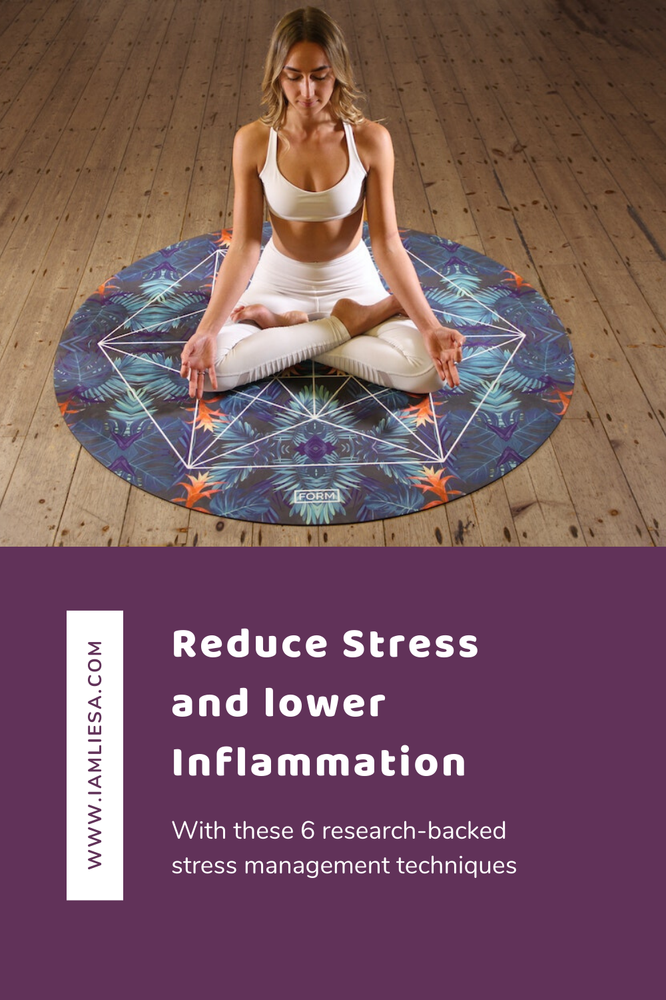

According to the [World Health Organization](http://www.euro.who.int/__data/assets/pdf_file/0008/96452/E87301.pdf) stress, especially work related stress, is one of the major threats to the well-being of Europeans.

A lot of the time we blame our genes for the status of our health when really they only account for 5 percent of the symptoms we experience. This shows that the future of our health is not predetermined by the genes we were born with but is shaped by our everyday lifestyle choices, including how we manage stress. 

By making smart lifestyle choices, e.g. lowering stress levels, concentrating on a healthy diet and exercising regularly, we can reduce inflammation and influence the expression of 95 percent of disease-related gene mutation, including genes for cardiovascular disease, Alzheimer’s disease, diabetes, and many types of cancer. 

In this article we will cover an important aspect of inflammation, namely **stress-induced inflammation** that occurs through disturbing the balance of the immune system. We have already talked about [stress mechanisms](https://www.iamliesa.com/stress-inflammation) and what stress does to our body and health. Today I want to show you some science-backed ways to manage stress in order to reduce inflammation and lower the risk for disease.

# Manage stress and reduce inflammation

More and more research seems to indicate that severe prolonged (chronic) stress leads to an **increased risk for so called stress-related diseases** such as heart disease, asthma, [obesity](https://www.iamliesa.com/inflammation-obesity), headaches, Alzheimer’s, depression and many more. [(1,](https://www.sciencedirect.com/science/article/abs/pii/S0022399901003026) [2,](https://www.nature.com/articles/nrn1683) [3,](https://www.nature.com/articles/nrcardio.2012.45) [4,](https://thorax.bmj.com/content/53/12/1066.short) [5)](https://academic.oup.com/abm/article-abstract/15/1/17/4616976) This research makes one thing crystal clear: We need to **manage our levels of stress** if we want to live a healthful life and lower inflammation. 

There are many research-backed ways to reduce stress. Most of us are familiar with at least one or two techniques, e.g. **yoga** or **meditation**. However, these are not the only ways to manage stress effectively. Let’s look at some more methods that are proven to bring results.

# 1. Manage stress with the Emotional Freedom Technique (EFT)

One way to reduce or at least manage stress is with the Emotional Freedom Technique or EFT. EFT is a simple stress relief technique that was first introduced by Gary Craig in the 90’s. It is a brief exposure therapy that combines a cognitive and a somatic (meaning a bodily) element. 

The technique is based on the discovery that emotional trauma contributes greatly to disease and that the cause of all negative emotions is a disruption in the body’s energy system. Through tapping, different energy points are stimulated in order to release energy and restore balance. EFT is then able to rapidly reduce the emotional impact of memories and incidents that lead to emotional distress as scientific studies have shown [6](https://www.ncbi.nlm.nih.gov/pmc/articles/PMC6381429/). Only when distress is reduced or removed can the body rebalance itself and begin the healing process.

**How EFT works:**

Since according to EFT the cause of negative emotion is a disruption in the body’s energy system, the goal is to clear these by tapping on the meridian points, similar to acupuncture. Restoring the energy balance can lead to a relief of symptoms that a negative experience or emotion has caused.

The first step in EFT is to **identify the issue or fear you hold**, which will be your focal point while tapping. It’s best to only focus on one issue at a time for a better outcome.

The second step is to **identify the level of intensity** the problem holds on a scale from 0 to 10, with 10 being the worst. Like this, you can monitor your progress after performing a complete EFT sequence. 

Next, you’ll establish a phrase that is focused on two main goals:

* acknowledge the issue
* accepting yourself in spite of the problem

This is the common setup phrase: *“Even though I have this [fear or problem], I deeply and completely accept myself.”*

It’s important to keep in mind that your setup sentence only addresses your own problem. For example, you cannot say, “Even though my sister is sad, I deeply and completely accept myself.” Always focus on how a problem is making you feel in order to relieve the distress it causes. You could, for example, rephrase the sentence like this: *“Even though I feel sorry that my sister is sad, I deeply and completely accept myself.”*

After that, you’ll get into the tapping. There are nine points, each of which you’ll tap approximately 5 times with two fingers. 

Start by tapping the  ‘karate chop point’ - the soft spot on the side of either hand - just below your little finger whilst repeating your setup phrase three times.

Then come up with a reminder phrase which will be spoken aloud while tapping the other points. The reminder phrase should be a brief reminder of the setup phrase, for example *“How sorry I feel that my sister is sad.”*

**After that, tap through all of the other points:**

* Inner eyebrow, just above the inner corner where nose meets eyebrow
* Outer eye, outside edge of the eye, on the bone
* Under the nose, between nose and lips
* On the chin, midway between the point of your chin and the bottom of your lower lip
* Beginning of the collarbone
* Under your arm, approximately where your bra strap is
* At the top of the head

After completing your first sequence, evaluate the level of discomfort your problem or issue holds on a scale from 0 to 10. Repeat the sequence until you rate it 2 or less. Your final setup phrase could be, “Even though I still feel sorry for my sister, I choose to let it go now as this emotion no longer serves me.” The reminder phrase then could be “I am free of the emotion.”

**Results & Benefits of EFT:**

According to a [study from 2008](https://www.researchgate.net/publication/279581378_Self-administered_EFT_Emotional_Freedom_Techniques_in_individuals_with_fibromyalgia_A_randomized_trial), the application of the Emotional Freedom Technique lead to statistically significant **improvements for variables such as pain, anxiety, depression, vitality, social function, mental health, performance problems involving work or other activities due to physical as well as emotional reasons, and stress symptoms**.

[Another study](https://www.ncbi.nlm.nih.gov/pubmed/21571234) showed similar results with regards to anxiety. EFT was able to significantly reduce phobia-related anxiety and the ability to approach the feared stimulus.

Yet another [study with nursing students](https://www.sciencedirect.com/science/article/abs/pii/S0260691716000617) didn’t only show a statistically significant **decrease in anxiety**, but also a significant **reduction in self-reported stress**.

# 2. Reducing stress through Autogenic Training (AT)

Autogenic Training is a self-relaxation procedure developed by the German psychiatrist Johannes Heinrich Schulz which was first published in 1932 that seems to be very effective in the management of stress. The aim of AT is to attain a state of complete relaxation by focusing on promoting feelings of calm in your body to help reduce physical and emotional stress as well as anxiety that may overwhelm us with frustration or sadness.

**How Autogenic Training works:**

The first step in a training session is to find a **quiet and calm space** where you can sit or lie comfortably. This position must promote relaxation, however, it is important that you don’t fall asleep. 

Then, begin to slow down your breathing and focus on even, deep breaths. Once your breathing is consistent, you or your therapist will guide your attention to one part of the body or one function in each phase of the training. 

Typically, a session will focus on the following six techniques:

**Inducing heaviness in the body:** Repeat the verbal formula, “My arms are heavy.” six times and then say, “I am completely calm.” Repeat the same for the legs.
**Inducing a feeling of warmth:** Repeat the verbal formula, “My arms a very warm.” six times, then going back to “I am completely calm.” Repeat the same for the legs.
**Drawing attention to the heartbeat:** Quietly and slowly repeat to yourself six times, “My heartbeat is calm and regular.” Then go back to the sentence, “I am completely calm.” 
**Focusing on and regulating breathing:** Quietly and slowly repeat to yourself six times, “My breathing is calm and regular.” Then quietly say to yourself, “I am completely calm.”
**Focusing on abdominal sensations:** Repeat six times, “My abdomen is warm.” Then quietly say to yourself, “I am completely calm.”
**Drawing attention to the coolness of the forehead:** Repeat to yourself six times, “My forehead is pleasantly cool.” Then quietly finish with, “I am completely calm.”

At the end of the session, you should feel a sense of calm, relaxation, warmth, and heaviness in your different body parts.

**Results & Benefits of Autogenic Training:** 

Autogenic Training is mainly known as an effective treatment for stress. However, it has been shown to be beneficial for other conditions, too, such as migraine, insomnia, hypertension, angina pectoris, asthma as well as psychological disorders e.g. anxiety and depression [(7,](https://www.sciencedirect.com/science/article/abs/pii/S096522999780060X?via%3Dihub) [8)](https://searchworks.stanford.edu/view/5082392). Its effectiveness has been investigated in [many studies](https://link.springer.com/article/10.1007/BF01721069).

# 3. Lowering stress with Progressive Muscle Relaxation (PMR)

Progressive Muscle Relaxation (PMR) is another great technique to reduce stress and tension and therefore reduce inflammation. It was first introduced by the American physician Edmund Jacobson in the early 1920s. The technique to reduce stress and anxiety works by alternately tensing and releasing major muscle groups in your body [(9)](https://psycnet.apa.org/record/1938-04698-000). Jacobson argued that since muscle tension accompanies anxiety, it only makes sense that one can reduce it by learning how to release the tension in the muscles. By concentrating on the different feeling between tensing and relaxing the muscles, you can become more aware of your body and physical sensations.

**How Progressive Muscle Relaxation works:**

Look for a quiet place where you can sit or lie comfortably. Take a deep breath in through your nose and exhale all the oxygen from your mouth, drawing your navel towards your spine. Repeat for three to five times.

Then start at the bottom with your feet: Point your feet downward and curl your toes under. Tighten the toe muscles and hold this tension for a few moments, about 5 to 7 seconds. Pay attention to the feeling of tension in your feet, then release, exhale and notice the relaxation. Stay in this relaxed state for about 15 seconds, then move on to the next muscle group.

Work your way up to your body in this order: legs, glutes, abdomen, back, hands, arms, shoulders, neck, and face. Repeat any areas that feel particularly stiff.

End the PMR by taking a few relaxing deep breaths, paying close attention to how your body feels after tightening and releasing all the muscles. Can you feel the difference?

It’s important to practice PMR regularly, especially at the beginning. Start by taking 10 to 20 minutes each day to practice so that it becomes part of your daily routine. You’ll see how your muscles are able to learn and thus, with time, they can relax in a matter of seconds which will make you more resilient to stress.

**Results & Benefits of Progressive Muscle Relaxation:**

Some of the long-term benefits of a regular PMR practice include the **reduction of salivary cortisol levels (salivary cortisol levels is a biological marker of stress reactions) as well as perceived stress** [(10)](https://www.ncbi.nlm.nih.gov/pubmed/12100842), decreased blood pressure and pulse rate in people with essential hypertension [(11)](https://www.ncbi.nlm.nih.gov/pubmed/12597674) and a significantly decreased amount of headaches after only 6 to 7 weeks of PMR [(12)](https://www.ncbi.nlm.nih.gov/pubmed/16942472). Furthermore, a single session of PMR was able to effectively reduce state anxiety in test subjects after exposure to a transitory stressor [(13)](https://psycnet.apa.org/record/2006-10511-002).

# 4. Managing stress with Diaphragmatic Breathing

Diaphragmatic breathing is another technique to manage stress and therefore reduce inflammation. It is a type of breathing that engages your diaphragm, a dome-shaped sheet of muscle at the bottom of your ribcage. It is marked by expansion of the abdomen rather than the chest and is also known as belly breathing or abdominal breathing. 

Diaphragmatic breathing can be looked at as a manipulation of breath movement as it consists of a slower respiration rate, and smooth flow rates. During the inhalation the abdominal expands, during the exhalation it contracts. 

**How Diaphragmatic Breathing works:**

Sit or lie in a comfortable, quiet place, relax your body and put one hand on your chest and the other below your ribcage, close to your stomach. 

Now breathe in slowly through your nose, feeling the air move downward so that you feel your stomach rise. Make sure not to force or push your abdominal muscles outward. 

Ideally, your hand on the chest remains relatively still while the hand on your belly moves up and down as you breathe in and out. 

Then, breathe out through your mouth while pursing your lips. Let your belly relax and feel the hand on your belly fall inward toward your spine. Again, don’t force any movements, just move with the breath. 

Note that the exhalation time which includes an exhalation pause is significantly longer than the inhalation time.

For best results, practice Diaphragmatic Breathing 5 to 10 minutes about 3 or 4 times a day. 

Health disclaimer: If you feel lightheaded at any time during the practice, stop the exercise and sit down if you’re standing.

**Results & Benefits of Diaphragmatic Breathing:**

Several empirical studies have shown that diaphragmatic breathing may trigger body relaxation responses and benefits both physical and mental health. 

A study with 40 participants showed that after just 20 sessions, implemented over 8 weeks, diaphragmatic breathing was able to **significantly lower cortisol** (remember, the stress hormone) levels after training. [(13)](https://www.frontiersin.org/articles/10.3389/fpsyg.2017.00874/full) It was also helpful in the management of acute stressful tasks [(14)](https://www.ncbi.nlm.nih.gov/pubmed/18003209) and the reduction of hypertension [(15,](https://www.ncbi.nlm.nih.gov/pubmed/19534616) [16)](https://www.ncbi.nlm.nih.gov/pubmed/16765850). Furthermore, it has been shown to be helpful in the prophylaxis of migraines after 6 months of training and home practice [(17)](https://www.ncbi.nlm.nih.gov/pubmed/16150370).

# Yoga

Yoga is probably one of the best known techniques to manage stress and it has also been shown to have a positive impact on inflammation. It is a group of physical, mental, and spiritual practices that originated in ancient India. 

Yoga practices, schools, and goals vary and therefore there is not one definition of yoga. In the Western world, the term often denotes a modern form of hatha yoga, a particular type of yoga, and yoga as exercise, consisting largely of the postures, so called asanas. These are often connected by flowing sequences called vinyasa, as well as breathing exercises of pranayama. A session usually ends with a period of relaxation on the mat, called savasana.

Originally, the goal of hatha yoga was spiritual liberation through the raising of kundalini energy. Today, especially in the Western society, this is largely replaced by the goals of fitness and relaxation. It can help with body awareness, flexibility and mobility, strength, and balance. By shifting into a more relaxed state, yoga helps to decrease stress, promote a stronger connection with yourself, and increase focus.

**How Yoga works:**

Yoga isn’t one-size-fits-all and every practice and class looks different. There are many types of yoga and each approach differs from the other. Some of the most popular yoga styles are hatha yoga, vinyasa, ashtanga, jivamukti, kundalini, yin, and bikram yoga. They mainly differ in the amount of spiritual elements, such as chanting and mantras, that are incorporated in the practice and in the pace and style of asanas that are done.

Usually, a yoga practice starts by sitting comfortably on the mat, mostly in easy sit, with the eyes closed. This is called the initial relaxation. During this relaxation period you start to focus only on yourself, you calm your mind, and you set an intention for the practice.

The initial relaxation is followed by pranayama - breathing exercises to increase your prana, your life energy. However, a lot of yoga practitioners skip this part of the practice and head straight to the asanas.

Classically, however, pranayama is followed by a warm-up phase, following a very specific sequence called sun salutation or surya namaskar. Only after completing this sequence for a few round you’ll start with the asanas, the yoga exercises. Originally, there were around 84 asanas in 1830. By 1984, a whooping 900 and more yoga exercises were performed.

A yoga class closes with the final relaxation in savasana. Here you’ll lie on your back with your arms to your sides, palms facing up. The legs should be separate and the feet drop open. During these 5 to 10 minutes of total relaxation, the full benefits of your practice start to kick in. You’ll start to feel a physical, mental and spiritual relaxation. Therefore, savasana should not be skipped, even though from the outside it might look like you’re simply sleeping. 

**Results & Benefits of Yoga:**

The benefits of yoga have long been discussed and they range from greater flexibility to increased muscle strength and tone, to cardio and circulatory health and stress relief. These benefits of yoga are also scientifically backed up. Positive results have also been seen with regards to inflammation. 

[One study](https://www.sciencedirect.com/science/article/abs/pii/S1071916407011669) showed that yoga improved exercise tolerance and positively affected levels of [inflammatory markers](https://www.iamliesa.com/inflammation-blood-test-inflammatory-markers) in patients with heart failure.  

[Another study](https://www.liebertpub.com/doi/abs/10.1089/acm.2011.0265) with 86 patients showed that a yoga-based lifestyle with asanas (postures), pranayama (breathing exercises), stress management, group discussions, lectures, and individualized advice reduced the markers of stress and inflammation as early as 10 days in patients with chronic disease.

Yet [another study](https://www.ncbi.nlm.nih.gov/pmc/articles/PMC2820143/) acknowledges the ability of yoga to minimize inflammatory responses to stressful encounters as this influences the burden that stressors place on an individual. The author concludes: “If yoga dampens or limits stress-related changes, then regular practice could have substantial health benefits.”

In [another study](https://www.sciencedirect.com/science/article/abs/pii/S0031938412000455), scientists compared *leptin* and *adiponectin* data from 25 novices and 25 expert yoga practitioners.  The hormone leptin, that is involved in the regulation of appetite, metabolism and calorie burning, plays a proinflammatory role, while adiponectin has anti-inflammatory properties. The data showed that leptin was 36% higher among yoga novices compared to experts. Therefore the author concluded that intensive yoga practice may benefit health by altering leptin and adiponectin production. 

**6. Lowering stress with Meditation**

A lot of people have realized the benefits of meditation with regards to lowering stress. Stress begins in our mind with the perception that our well-being is in danger. Therefore, working with the mind to alter our perceptions is a very powerful technique for quieting our stress response.

It is rather difficult to find a common definition of meditation, as practices vary from individual to individual and also between traditions. In [Wikipedia](https://en.wikipedia.org/wiki/Meditation) it is defined as “a practice where an individual uses a technique - such as mindfulness, or focusing the mind on a particular object, thought, or activity - **to train attention and awareness, and achieve a mentally clear and emotionally calm and stable state.**” 

Stress is a state where our [fight-or-flight response](https://www.iamliesa.com/stress-inflammation) is activated even though most situations we experience don’t threaten our lives. Still, our minds react in a way as if our lives were in danger and floods the body with *adrenaline* to get us in a state of fighting or fleeing the scene of danger. Now meditation helps us to **reframe the experience to make it less stressful and more accurate in reflecting what is really going on in a situation**. This way, with time and practice, we learn to quiet the fight-or-flight response and are able to better cope with stressful situations. 

**How Meditation works:**

Just as difficult as it is to define meditation, it is to explain how meditation works. There are just too many different approaches. 

Probably the most common meditation technique to reduce stress in the West is the *focused (or concentrative) meditation*. Here, the practitioner focuses the attention on a chosen object, breathing, image, or words.

Opposed to this is the *open meditation*, a form of *mindfulness meditation*, where attention shifts mindfully and non-reactively to anything that occurs in experience without focusing on any explicit object. 
Mindfulness meditation is a technique that teaches you to slow down thoughts, let go of negativity, and calm your body and mind. These techniques can vary, generally though they involve breathing practice, mental imagery, muscle and body relaxation, and awareness of body and mind.

Another very popular meditation technique to reduce psychophysiological stress is the *Transcendental Meditation*. The technique is quite simple and easily learned. It is recommended to practice transcendental meditation for 20 minutes twice per day while sitting e.g. in full-lotus or half-lotus pose with eyes closed and repeating a mantra, a sequence of sounds specific to each individual e.g. OM. The goal is to promote a natural shift of awareness to a wakeful but deeply relaxed state.

Transcendental meditation is taught through a seven-step course by a certified TM teacher. During the practice, you will experience a reduction in mental and physical activity. This state is called transcendental consciousness and through it our body goes back to a normal function of various bodily systems, especially those involved in adapting to environmental stressors or challenges.

**Results & Benefits of Meditation:**

Several studies have already shown the positive effects of meditation with regards to stress management. In fact, stress reduction is one of the most common reasons people start meditating. 

[One study with 3515 participants](https://www.ncbi.nlm.nih.gov/pubmed/24395196) showed meditation programs can result in small to moderate reduction of multiple negative dimensions of psychological stress.

Mental and physical stress leads to increased levels of the stress hormone cortisol. This hormone is responsible for many of the harmful effects of stress, e.g. the release of pro-inflammatory chemicals called cytokines. [Inflammation is responsible for many diseases](https://www.iamliesa.com/inflammatory-diseases-inflammation) such as high blood pressure, metabolic syndrome, dementia or cancer.

[An eight-week Mindfulness-Based Stress Reduction (MBSR) intervention](https://www.sciencedirect.com/science/article/abs/pii/S0889159112004758) showed how using a meditation style called “mindfulness meditation” can reduce this inflammation response caused by stress.

[Another study with 60 meditators](https://psycnet.apa.org/record/1976-20168-001), 30 of whom were experienced, while the other 30 were controls, showed how meditation can help to cope with environmental stressors. The 60 meditators either meditated relaxed with eyes closed or open and then watched a stressor film. Afterward, the stress response was assessed. It showed that meditation does indeed have a positive effect on an individual’s stress level as well as experienced subjective anxiety.

Research also shows interesting results as to how meditation might affect inflammation. [One study from 2016](https://www.ncbi.nlm.nih.gov/pmc/articles/PMC4940234/) found that “findings suggest possible effects of mindfulness meditation on specific markers of inflammation, cell-mediated immunity, and biological aging”. These results, however, are tentative and further investigation has to be conducted. 

[In another study](https://www.sciencedirect.com/science/article/abs/pii/S0006322316000792), 35 stressed job-seeking unemployed adults were randomized to either a 3-day intensive residential mindfulness meditation or relaxation training program. The findings suggest that mindfulness meditation training may indeed have positive effects on markers of inflammatory disease risk.

# Conclusion: Stress management techniques can lower stress and inflammation levels 

The findings of these studies proof the effectiveness of stress reduction techniques to manage and lower stress. They also show that effective stress management may result in a reduction of disease symptoms, prevention of disease and/or improvement of quality of life. Since inflammation is at the root of all disease and may be induced through a stress reaction, lowering stress levels may enhance health overall and have a positive impact on health related problems such as cardiovascular disease, high blood pressure, diabetes, obesity, and headaches.

However, the literature also shows that further research has to be conducted and that in order to establish the usefulness of the stress-reduction techniques mentioned here, there is a need for more extensive randomized control trials.

<Divider />

<NotADoctor />

